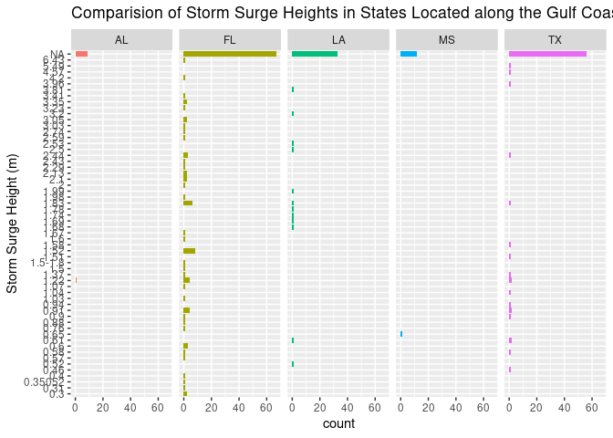
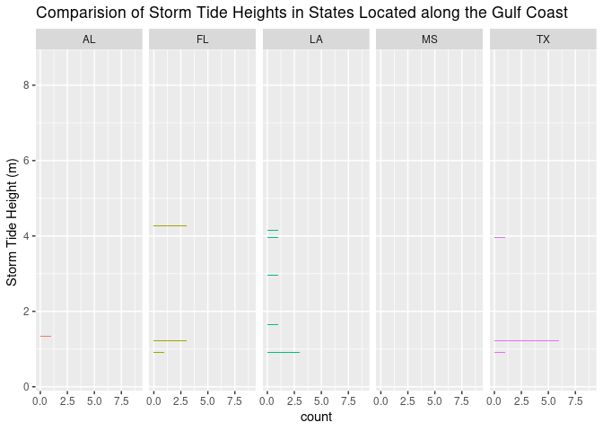

What Impacts do Artificial Oyster Reef have on Land Erosion Caused by
Storm Surges in the Gulf Coast?
================
2023-03-30

``` r
library(tidyverse)
```

    ## ── Attaching core tidyverse packages ──────────────────────── tidyverse 2.0.0 ──
    ## ✔ dplyr     1.1.1     ✔ readr     2.1.4
    ## ✔ forcats   1.0.0     ✔ stringr   1.5.0
    ## ✔ ggplot2   3.4.1     ✔ tibble    3.2.1
    ## ✔ lubridate 1.9.2     ✔ tidyr     1.3.0
    ## ✔ purrr     1.0.1     
    ## ── Conflicts ────────────────────────────────────────── tidyverse_conflicts() ──
    ## ✖ dplyr::filter() masks stats::filter()
    ## ✖ dplyr::lag()    masks stats::lag()
    ## ℹ Use the ]8;;http://conflicted.r-lib.org/conflicted package]8;; to force all conflicts to become errors

``` r
library(readr)
library(skimr)
library(dplyr)
```

# Import Data Manually

\*\*Dont need hurricane due to being already completed\*

*Storm Surge Dataset*

``` r
stormsurge <- read_csv("globalpeaksurgedb.csv")
```

    ## Rows: 745 Columns: 23
    ## ── Column specification ────────────────────────────────────────────────────────
    ## Delimiter: ","
    ## chr (10): Storm Name, Storm Dates, Time, Country, State, Location, Surge_m, ...
    ## dbl (13): Year, Reg, Sub Reg, Lat, Lon, Surge_ft, Storm_Tide_m, Storm_Tide_f...
    ## 
    ## ℹ Use `spec()` to retrieve the full column specification for this data.
    ## ℹ Specify the column types or set `show_col_types = FALSE` to quiet this message.

``` r
Encrusting_organism <- read_csv("2017-2019 Encrusting organism count and density (1).csv")
```

    ## Rows: 334842 Columns: 12
    ## ── Column specification ────────────────────────────────────────────────────────
    ## Delimiter: ","
    ## chr  (3): DATE, SITE, LOCATION
    ## dbl  (8): SECTION, PLOT, OYSTER_COUNT, MUSSEL_COUNT, BARNACLE_COUNT, OYSTER_...
    ## time (1): TIME
    ## 
    ## ℹ Use `spec()` to retrieve the full column specification for this data.
    ## ℹ Specify the column types or set `show_col_types = FALSE` to quiet this message.

``` r
Oyster_shell <- read_csv("2017-2019 Oyster shell heights (1).csv")
```

    ## Rows: 2004 Columns: 6
    ## ── Column specification ────────────────────────────────────────────────────────
    ## Delimiter: ","
    ## chr (3): DATE, SITE, LOCATION
    ## dbl (3): SECTION, PLOT, SIZE
    ## 
    ## ℹ Use `spec()` to retrieve the full column specification for this data.
    ## ℹ Specify the column types or set `show_col_types = FALSE` to quiet this message.

**SKIM DATA**

``` r
skim(Oyster_shell)
```

|                                                  |              |
|:-------------------------------------------------|:-------------|
| Name                                             | Oyster_shell |
| Number of rows                                   | 2004         |
| Number of columns                                | 6            |
| \_\_\_\_\_\_\_\_\_\_\_\_\_\_\_\_\_\_\_\_\_\_\_   |              |
| Column type frequency:                           |              |
| character                                        | 3            |
| numeric                                          | 3            |
| \_\_\_\_\_\_\_\_\_\_\_\_\_\_\_\_\_\_\_\_\_\_\_\_ |              |
| Group variables                                  | None         |

Data summary

**Variable type: character**

| skim_variable | n_missing | complete_rate | min | max | empty | n_unique | whitespace |
|:--------------|----------:|--------------:|----:|----:|------:|---------:|-----------:|
| DATE          |         0 |             1 |   9 |  10 |     0 |        4 |          0 |
| SITE          |         0 |             1 |   2 |   4 |     0 |        6 |          0 |
| LOCATION      |         0 |             1 |   7 |   8 |     0 |        2 |          0 |

**Variable type: numeric**

| skim_variable | n_missing | complete_rate |  mean |    sd |  p0 |   p25 |   p50 | p75 |  p100 | hist  |
|:--------------|----------:|--------------:|------:|------:|----:|------:|------:|----:|------:|:------|
| SECTION       |         0 |             1 |  1.99 |  0.82 | 1.0 |  1.00 |  2.00 |   3 |   3.0 | ▇▁▇▁▇ |
| PLOT          |         0 |             1 |  2.00 |  0.83 | 1.0 |  1.00 |  2.00 |   3 |   3.0 | ▇▁▇▁▇ |
| SIZE          |         0 |             1 | 60.61 | 18.53 | 3.9 | 48.68 | 60.65 |  73 | 128.7 | ▁▅▇▂▁ |

``` r
skim(Encrusting_organism)
```

|                                                  |                     |
|:-------------------------------------------------|:--------------------|
| Name                                             | Encrusting_organism |
| Number of rows                                   | 334842              |
| Number of columns                                | 12                  |
| \_\_\_\_\_\_\_\_\_\_\_\_\_\_\_\_\_\_\_\_\_\_\_   |                     |
| Column type frequency:                           |                     |
| character                                        | 3                   |
| difftime                                         | 1                   |
| numeric                                          | 8                   |
| \_\_\_\_\_\_\_\_\_\_\_\_\_\_\_\_\_\_\_\_\_\_\_\_ |                     |
| Group variables                                  | None                |

Data summary

**Variable type: character**

| skim_variable | n_missing | complete_rate | min | max | empty | n_unique | whitespace |
|:--------------|----------:|--------------:|----:|----:|------:|---------:|-----------:|
| DATE          |    334530 |             0 |   9 |  10 |     0 |        4 |          0 |
| SITE          |    334530 |             0 |   2 |   4 |     0 |        6 |          0 |
| LOCATION      |    334530 |             0 |   7 |   8 |     0 |        2 |          0 |

**Variable type: difftime**

| skim_variable | n_missing | complete_rate | min        | max        | median     | n_unique |
|:--------------|----------:|--------------:|:-----------|:-----------|:-----------|---------:|
| TIME          |    334542 |             0 | 36000 secs | 59400 secs | 46560 secs |       30 |

**Variable type: numeric**

| skim_variable    | n_missing | complete_rate |   mean |      sd |  p0 |    p25 |   p50 |  p75 | p100 | hist  |
|:-----------------|----------:|--------------:|-------:|--------:|----:|-------:|------:|-----:|-----:|:------|
| SECTION          |    334530 |             0 |   1.98 |    0.82 |   1 |   1.00 |   2.0 |    3 |    3 | ▇▁▇▁▇ |
| PLOT             |    334530 |             0 |   2.00 |    0.82 |   1 |   1.00 |   2.0 |    3 |    3 | ▇▁▇▁▇ |
| OYSTER_COUNT     |    334530 |             0 |   6.80 |    4.41 |   0 |   4.00 |   6.5 |   10 |   18 | ▆▇▅▃▂ |
| MUSSEL_COUNT     |    334530 |             0 |  55.12 |   89.58 |   0 |   1.75 |  20.0 |   75 |  500 | ▇▁▁▁▁ |
| BARNACLE_COUNT   |    334530 |             0 |  59.57 |   65.78 |   0 |  10.00 |  30.0 |  100 |  300 | ▇▂▁▁▁ |
| OYSTER_DENSITY   |    334530 |             0 | 108.87 |   70.48 |   0 |  64.00 | 104.0 |  160 |  288 | ▆▇▅▃▂ |
| MUSSEL_DENSITY   |    334530 |             0 | 881.90 | 1433.24 |   0 |  28.00 | 320.0 | 1200 | 8000 | ▇▁▁▁▁ |
| BARNACLE_DENSITY |    334530 |             0 | 953.18 | 1052.53 |   0 | 160.00 | 480.0 | 1600 | 4800 | ▇▂▁▁▁ |

``` r
skim(stormsurge)
```

|                                                  |            |
|:-------------------------------------------------|:-----------|
| Name                                             | stormsurge |
| Number of rows                                   | 745        |
| Number of columns                                | 23         |
| \_\_\_\_\_\_\_\_\_\_\_\_\_\_\_\_\_\_\_\_\_\_\_   |            |
| Column type frequency:                           |            |
| character                                        | 10         |
| numeric                                          | 13         |
| \_\_\_\_\_\_\_\_\_\_\_\_\_\_\_\_\_\_\_\_\_\_\_\_ |            |
| Group variables                                  | None       |

Data summary

**Variable type: character**

| skim_variable | n_missing | complete_rate | min | max | empty | n_unique | whitespace |
|:--------------|----------:|--------------:|----:|----:|------:|---------:|-----------:|
| Storm Name    |        25 |          0.97 |   3 |  37 |     0 |      385 |          0 |
| Storm Dates   |       148 |          0.80 |   3 |  17 |     0 |      526 |          0 |
| Time          |       738 |          0.01 |   5 |   8 |     0 |        7 |          0 |
| Country       |         1 |          1.00 |   2 |   5 |     0 |       38 |          0 |
| State         |       255 |          0.66 |   2 |   6 |     0 |       29 |          0 |
| Location      |        42 |          0.94 |   4 |  58 |     0 |      502 |          0 |
| Surge_m       |       374 |          0.50 |   1 |   7 |     0 |      166 |          0 |
| Datum         |       663 |          0.11 |   3 |  46 |     0 |       35 |          0 |
| Type of Obs   |       718 |          0.04 |   4 |  48 |     0 |       18 |          0 |
| Tropical      |         0 |          1.00 |   1 |   1 |     0 |        2 |          0 |

**Variable type: numeric**

| skim_variable       | n_missing | complete_rate |    mean |     sd |      p0 |     p25 |     p50 |     p75 |    p100 | hist  |
|:--------------------|----------:|--------------:|--------:|-------:|--------:|--------:|--------:|--------:|--------:|:------|
| Year                |         0 |          1.00 | 1969.44 |  34.76 | 1737.00 | 1953.00 | 1976.00 | 1998.00 | 2014.00 | ▁▁▁▃▇ |
| Reg                 |         1 |          1.00 |    3.64 |   1.84 |    1.00 |    2.00 |    5.00 |    5.00 |   11.00 | ▆▇▁▁▁ |
| Sub Reg             |         9 |          0.99 |    1.72 |   1.08 |    1.00 |    1.00 |    1.00 |    2.00 |    6.00 | ▇▂▁▁▁ |
| Lat                 |       158 |          0.79 |   20.54 |  17.50 |  -33.33 |   20.05 |   26.77 |   30.11 |   52.34 | ▁▁▁▇▁ |
| Lon                 |       158 |          0.79 |  -16.32 |  98.61 | -179.05 |  -88.16 |  -80.16 |  110.17 |  179.20 | ▁▇▁▁▃ |
| Surge_ft            |       467 |          0.37 |    7.79 |   5.49 |    0.94 |    4.00 |    6.48 |   10.00 |   44.95 | ▇▃▁▁▁ |
| Storm_Tide_m        |       374 |          0.50 |    2.91 |   1.96 |    0.20 |    1.60 |    2.38 |    3.78 |   13.70 | ▇▅▁▁▁ |
| Storm_Tide_ft       |       451 |          0.39 |    9.45 |   6.28 |    0.72 |    4.94 |    7.11 |   13.18 |   31.50 | ▇▅▃▁▁ |
| Storm_Tide_Waves_m  |       736 |          0.01 |    6.03 |   1.88 |    3.40 |    5.00 |    6.00 |    7.60 |    9.20 | ▇▇▇▇▃ |
| Storm_Tide_Waves_ft |       740 |          0.01 |   22.50 |   5.28 |   16.40 |   19.68 |   21.33 |   24.93 |   30.18 | ▃▇▁▃▃ |
| Confidence          |       305 |          0.59 |    2.37 |   0.60 |    1.00 |    2.00 |    2.00 |    3.00 |    4.00 | ▁▇▁▆▁ |
| Surge ID            |       402 |          0.46 |  268.54 | 100.25 |    2.00 |  204.50 |  289.00 |  339.60 |  429.00 | ▁▃▃▇▅ |
| Storm ID            |       402 |          0.46 |  268.48 | 100.26 |    2.00 |  204.50 |  289.00 |  339.50 |  429.00 | ▁▃▃▇▅ |

**DATA ANALYSIS**

``` r
stormsurge %>%
filter(Country == "US")
```

    ## # A tibble: 362 × 23
    ##     Year Storm N…¹ Storm…² Time    Reg Sub R…³ Country State Locat…⁴   Lat   Lon
    ##    <dbl> <chr>     <chr>   <chr> <dbl>   <dbl> <chr>   <chr> <chr>   <dbl> <dbl>
    ##  1  1880 "Unnamed" Aug 04… <NA>      5       1 US      TX    Near S…  26.2 -97.2
    ##  2  1886 "\xd0Ind… Aug 12… <NA>      5       1 US      TX    Indian…  28.5 -96.5
    ##  3  1886 "Unnamed" Oct 8-… <NA>      5       1 US      LA    Johnso…  29.8 -93.7
    ##  4  1886 "Unnamed" Jun 13… <NA>      5       1 US      TX    Sabine…  29.7 -94.0
    ##  5  1886 "Unnamed" Sep 16… <NA>      5       1 US      TX    Indian…  28.5 -96.5
    ##  6  1888 "Unnamed" Oct 8-… <NA>      5       1 US      FL    Cedar …  29.1 -83.0
    ##  7  1888 "Unnamed" Aug 14… <NA>      5       1 US      AL    Mobile   30.7 -88.0
    ##  8  1893 "\xd0Che… Sep 27… <NA>      5       1 US      LA    Chenie…  29.2 -90.1
    ##  9  1894 "Unnamed" Oct 1-… <NA>      5       1 US      AL    Fort M…  30.2 -88.0
    ## 10  1895 "Unnamed" Aug 22… <NA>      5       1 US      TX    Velasco  29.0 -95.4
    ## # … with 352 more rows, 12 more variables: Surge_m <chr>, Surge_ft <dbl>,
    ## #   Storm_Tide_m <dbl>, Storm_Tide_ft <dbl>, Storm_Tide_Waves_m <dbl>,
    ## #   Storm_Tide_Waves_ft <dbl>, Datum <chr>, `Type of Obs` <chr>,
    ## #   Tropical <chr>, Confidence <dbl>, `Surge ID` <dbl>, `Storm ID` <dbl>, and
    ## #   abbreviated variable names ¹​`Storm Name`, ²​`Storm Dates`, ³​`Sub Reg`,
    ## #   ⁴​Location

``` r
US_stormsurge <-stormsurge %>%
  filter(Country== "US")

Gulf_stormsurge <- stormsurge %>%
  filter(State == "AL" | State =="TX"| State == "LA" | State =="MS" | State == "FL")

Gulf_stormsurge
```

    ## # A tibble: 274 × 23
    ##     Year Storm N…¹ Storm…² Time    Reg Sub R…³ Country State Locat…⁴   Lat   Lon
    ##    <dbl> <chr>     <chr>   <chr> <dbl>   <dbl> <chr>   <chr> <chr>   <dbl> <dbl>
    ##  1  1880 "Unnamed" Aug 04… <NA>      5       1 US      TX    Near S…  26.2 -97.2
    ##  2  1886 "\xd0Ind… Aug 12… <NA>      5       1 US      TX    Indian…  28.5 -96.5
    ##  3  1886 "Unnamed" Oct 8-… <NA>      5       1 US      LA    Johnso…  29.8 -93.7
    ##  4  1886 "Unnamed" Jun 13… <NA>      5       1 US      TX    Sabine…  29.7 -94.0
    ##  5  1886 "Unnamed" Sep 16… <NA>      5       1 US      TX    Indian…  28.5 -96.5
    ##  6  1888 "Unnamed" Oct 8-… <NA>      5       1 US      FL    Cedar …  29.1 -83.0
    ##  7  1888 "Unnamed" Aug 14… <NA>      5       1 US      AL    Mobile   30.7 -88.0
    ##  8  1893 "\xd0Che… Sep 27… <NA>      5       1 US      LA    Chenie…  29.2 -90.1
    ##  9  1894 "Unnamed" Oct 1-… <NA>      5       1 US      AL    Fort M…  30.2 -88.0
    ## 10  1895 "Unnamed" Aug 22… <NA>      5       1 US      TX    Velasco  29.0 -95.4
    ## # … with 264 more rows, 12 more variables: Surge_m <chr>, Surge_ft <dbl>,
    ## #   Storm_Tide_m <dbl>, Storm_Tide_ft <dbl>, Storm_Tide_Waves_m <dbl>,
    ## #   Storm_Tide_Waves_ft <dbl>, Datum <chr>, `Type of Obs` <chr>,
    ## #   Tropical <chr>, Confidence <dbl>, `Surge ID` <dbl>, `Storm ID` <dbl>, and
    ## #   abbreviated variable names ¹​`Storm Name`, ²​`Storm Dates`, ³​`Sub Reg`,
    ## #   ⁴​Location

``` r
ggplot(Gulf_stormsurge, aes(y = Surge_m, fill = State)) +
  geom_bar()+
    facet_wrap(~ State, nrow = 1, labeller = label_wrap_gen(width = 12)) +
  labs(
    x = "Storm Surge Height",
    title = "Comparision of Storm Surge Heights in States Located along the Gulf Coast") + 
  theme(legend.position = "none") 
```

<!-- -->

``` r
ggplot(Gulf_stormsurge, aes(y = Storm_Tide_m, fill = State)) +
  geom_bar()+
    facet_wrap(~ State, nrow = 1, labeller = label_wrap_gen(width = 12)) +
  labs(
    x = "Storm Tide Height (m) ",
    title = "Comparision of Storm Tide Heights in States Located along the Gulf Coast") + 
  theme(legend.position = "none") 
```

    ## Warning: Removed 81 rows containing non-finite values (`stat_count()`).

<!-- -->
