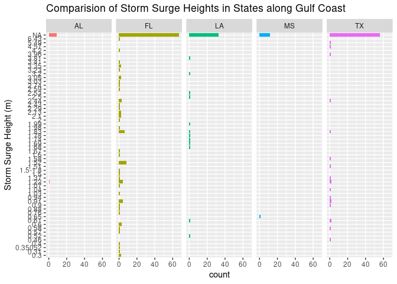

What Impacts do Artificial Oyster Reef have on Land Erosion Caused by
Storm Surges in the Gulf Coast?
================
2023-03-30

``` r
library(tidyverse)
```

    ## ── Attaching core tidyverse packages ──────────────────────── tidyverse 2.0.0 ──
    ## ✔ dplyr     1.1.1     ✔ readr     2.1.4
    ## ✔ forcats   1.0.0     ✔ stringr   1.5.0
    ## ✔ ggplot2   3.4.1     ✔ tibble    3.2.1
    ## ✔ lubridate 1.9.2     ✔ tidyr     1.3.0
    ## ✔ purrr     1.0.1     
    ## ── Conflicts ────────────────────────────────────────── tidyverse_conflicts() ──
    ## ✖ dplyr::filter() masks stats::filter()
    ## ✖ dplyr::lag()    masks stats::lag()
    ## ℹ Use the ]8;;http://conflicted.r-lib.org/conflicted package]8;; to force all conflicts to become errors

``` r
library(readr)
library(skimr)
library(dplyr)
```

# Import Data Manually

**Don’t need hurricane due to being already completed**

*Storm Surge Dataset*

``` r
stormsurge <- read_csv("globalpeaksurgedb.csv")
```

    ## Rows: 745 Columns: 23
    ## ── Column specification ────────────────────────────────────────────────────────
    ## Delimiter: ","
    ## chr (10): Storm Name, Storm Dates, Time, Country, State, Location, Surge_m, ...
    ## dbl (13): Year, Reg, Sub Reg, Lat, Lon, Surge_ft, Storm_Tide_m, Storm_Tide_f...
    ## 
    ## ℹ Use `spec()` to retrieve the full column specification for this data.
    ## ℹ Specify the column types or set `show_col_types = FALSE` to quiet this message.

``` r
Encrusting_organism <- read_csv("2017-2019 Encrusting organism count and density (1).csv")
```

    ## Rows: 334842 Columns: 12
    ## ── Column specification ────────────────────────────────────────────────────────
    ## Delimiter: ","
    ## chr  (3): DATE, SITE, LOCATION
    ## dbl  (8): SECTION, PLOT, OYSTER_COUNT, MUSSEL_COUNT, BARNACLE_COUNT, OYSTER_...
    ## time (1): TIME
    ## 
    ## ℹ Use `spec()` to retrieve the full column specification for this data.
    ## ℹ Specify the column types or set `show_col_types = FALSE` to quiet this message.

``` r
Oyster_shell <- read_csv("2017-2019 Oyster shell heights (1).csv")
```

    ## Rows: 2004 Columns: 6
    ## ── Column specification ────────────────────────────────────────────────────────
    ## Delimiter: ","
    ## chr (3): DATE, SITE, LOCATION
    ## dbl (3): SECTION, PLOT, SIZE
    ## 
    ## ℹ Use `spec()` to retrieve the full column specification for this data.
    ## ℹ Specify the column types or set `show_col_types = FALSE` to quiet this message.

**SKIM DATA**

``` r
skim(Oyster_shell)
```

|                                                  |              |
|:-------------------------------------------------|:-------------|
| Name                                             | Oyster_shell |
| Number of rows                                   | 2004         |
| Number of columns                                | 6            |
| \_\_\_\_\_\_\_\_\_\_\_\_\_\_\_\_\_\_\_\_\_\_\_   |              |
| Column type frequency:                           |              |
| character                                        | 3            |
| numeric                                          | 3            |
| \_\_\_\_\_\_\_\_\_\_\_\_\_\_\_\_\_\_\_\_\_\_\_\_ |              |
| Group variables                                  | None         |

Data summary

**Variable type: character**

| skim_variable | n_missing | complete_rate | min | max | empty | n_unique | whitespace |
|:--------------|----------:|--------------:|----:|----:|------:|---------:|-----------:|
| DATE          |         0 |             1 |   9 |  10 |     0 |        4 |          0 |
| SITE          |         0 |             1 |   2 |   4 |     0 |        6 |          0 |
| LOCATION      |         0 |             1 |   7 |   8 |     0 |        2 |          0 |

**Variable type: numeric**

| skim_variable | n_missing | complete_rate |  mean |    sd |  p0 |   p25 |   p50 | p75 |  p100 | hist  |
|:--------------|----------:|--------------:|------:|------:|----:|------:|------:|----:|------:|:------|
| SECTION       |         0 |             1 |  1.99 |  0.82 | 1.0 |  1.00 |  2.00 |   3 |   3.0 | ▇▁▇▁▇ |
| PLOT          |         0 |             1 |  2.00 |  0.83 | 1.0 |  1.00 |  2.00 |   3 |   3.0 | ▇▁▇▁▇ |
| SIZE          |         0 |             1 | 60.61 | 18.53 | 3.9 | 48.68 | 60.65 |  73 | 128.7 | ▁▅▇▂▁ |

``` r
skim(Encrusting_organism)
```

|                                                  |                     |
|:-------------------------------------------------|:--------------------|
| Name                                             | Encrusting_organism |
| Number of rows                                   | 334842              |
| Number of columns                                | 12                  |
| \_\_\_\_\_\_\_\_\_\_\_\_\_\_\_\_\_\_\_\_\_\_\_   |                     |
| Column type frequency:                           |                     |
| character                                        | 3                   |
| difftime                                         | 1                   |
| numeric                                          | 8                   |
| \_\_\_\_\_\_\_\_\_\_\_\_\_\_\_\_\_\_\_\_\_\_\_\_ |                     |
| Group variables                                  | None                |

Data summary

**Variable type: character**

| skim_variable | n_missing | complete_rate | min | max | empty | n_unique | whitespace |
|:--------------|----------:|--------------:|----:|----:|------:|---------:|-----------:|
| DATE          |    334530 |             0 |   9 |  10 |     0 |        4 |          0 |
| SITE          |    334530 |             0 |   2 |   4 |     0 |        6 |          0 |
| LOCATION      |    334530 |             0 |   7 |   8 |     0 |        2 |          0 |

**Variable type: difftime**

| skim_variable | n_missing | complete_rate | min        | max        | median     | n_unique |
|:--------------|----------:|--------------:|:-----------|:-----------|:-----------|---------:|
| TIME          |    334542 |             0 | 36000 secs | 59400 secs | 46560 secs |       30 |

**Variable type: numeric**

| skim_variable    | n_missing | complete_rate |   mean |      sd |  p0 |    p25 |   p50 |  p75 | p100 | hist  |
|:-----------------|----------:|--------------:|-------:|--------:|----:|-------:|------:|-----:|-----:|:------|
| SECTION          |    334530 |             0 |   1.98 |    0.82 |   1 |   1.00 |   2.0 |    3 |    3 | ▇▁▇▁▇ |
| PLOT             |    334530 |             0 |   2.00 |    0.82 |   1 |   1.00 |   2.0 |    3 |    3 | ▇▁▇▁▇ |
| OYSTER_COUNT     |    334530 |             0 |   6.80 |    4.41 |   0 |   4.00 |   6.5 |   10 |   18 | ▆▇▅▃▂ |
| MUSSEL_COUNT     |    334530 |             0 |  55.12 |   89.58 |   0 |   1.75 |  20.0 |   75 |  500 | ▇▁▁▁▁ |
| BARNACLE_COUNT   |    334530 |             0 |  59.57 |   65.78 |   0 |  10.00 |  30.0 |  100 |  300 | ▇▂▁▁▁ |
| OYSTER_DENSITY   |    334530 |             0 | 108.87 |   70.48 |   0 |  64.00 | 104.0 |  160 |  288 | ▆▇▅▃▂ |
| MUSSEL_DENSITY   |    334530 |             0 | 881.90 | 1433.24 |   0 |  28.00 | 320.0 | 1200 | 8000 | ▇▁▁▁▁ |
| BARNACLE_DENSITY |    334530 |             0 | 953.18 | 1052.53 |   0 | 160.00 | 480.0 | 1600 | 4800 | ▇▂▁▁▁ |

``` r
skim(stormsurge)
```

|                                                  |            |
|:-------------------------------------------------|:-----------|
| Name                                             | stormsurge |
| Number of rows                                   | 745        |
| Number of columns                                | 23         |
| \_\_\_\_\_\_\_\_\_\_\_\_\_\_\_\_\_\_\_\_\_\_\_   |            |
| Column type frequency:                           |            |
| character                                        | 10         |
| numeric                                          | 13         |
| \_\_\_\_\_\_\_\_\_\_\_\_\_\_\_\_\_\_\_\_\_\_\_\_ |            |
| Group variables                                  | None       |

Data summary

**Variable type: character**

| skim_variable | n_missing | complete_rate | min | max | empty | n_unique | whitespace |
|:--------------|----------:|--------------:|----:|----:|------:|---------:|-----------:|
| Storm Name    |        25 |          0.97 |   3 |  37 |     0 |      385 |          0 |
| Storm Dates   |       148 |          0.80 |   3 |  17 |     0 |      526 |          0 |
| Time          |       738 |          0.01 |   5 |   8 |     0 |        7 |          0 |
| Country       |         1 |          1.00 |   2 |   5 |     0 |       38 |          0 |
| State         |       255 |          0.66 |   2 |   6 |     0 |       29 |          0 |
| Location      |        42 |          0.94 |   4 |  58 |     0 |      502 |          0 |
| Surge_m       |       374 |          0.50 |   1 |   7 |     0 |      166 |          0 |
| Datum         |       663 |          0.11 |   3 |  46 |     0 |       35 |          0 |
| Type of Obs   |       718 |          0.04 |   4 |  48 |     0 |       18 |          0 |
| Tropical      |         0 |          1.00 |   1 |   1 |     0 |        2 |          0 |

**Variable type: numeric**

| skim_variable       | n_missing | complete_rate |    mean |     sd |      p0 |     p25 |     p50 |     p75 |    p100 | hist  |
|:--------------------|----------:|--------------:|--------:|-------:|--------:|--------:|--------:|--------:|--------:|:------|
| Year                |         0 |          1.00 | 1969.44 |  34.76 | 1737.00 | 1953.00 | 1976.00 | 1998.00 | 2014.00 | ▁▁▁▃▇ |
| Reg                 |         1 |          1.00 |    3.64 |   1.84 |    1.00 |    2.00 |    5.00 |    5.00 |   11.00 | ▆▇▁▁▁ |
| Sub Reg             |         9 |          0.99 |    1.72 |   1.08 |    1.00 |    1.00 |    1.00 |    2.00 |    6.00 | ▇▂▁▁▁ |
| Lat                 |       158 |          0.79 |   20.54 |  17.50 |  -33.33 |   20.05 |   26.77 |   30.11 |   52.34 | ▁▁▁▇▁ |
| Lon                 |       158 |          0.79 |  -16.32 |  98.61 | -179.05 |  -88.16 |  -80.16 |  110.17 |  179.20 | ▁▇▁▁▃ |
| Surge_ft            |       467 |          0.37 |    7.79 |   5.49 |    0.94 |    4.00 |    6.48 |   10.00 |   44.95 | ▇▃▁▁▁ |
| Storm_Tide_m        |       374 |          0.50 |    2.91 |   1.96 |    0.20 |    1.60 |    2.38 |    3.78 |   13.70 | ▇▅▁▁▁ |
| Storm_Tide_ft       |       451 |          0.39 |    9.45 |   6.28 |    0.72 |    4.94 |    7.11 |   13.18 |   31.50 | ▇▅▃▁▁ |
| Storm_Tide_Waves_m  |       736 |          0.01 |    6.03 |   1.88 |    3.40 |    5.00 |    6.00 |    7.60 |    9.20 | ▇▇▇▇▃ |
| Storm_Tide_Waves_ft |       740 |          0.01 |   22.50 |   5.28 |   16.40 |   19.68 |   21.33 |   24.93 |   30.18 | ▃▇▁▃▃ |
| Confidence          |       305 |          0.59 |    2.37 |   0.60 |    1.00 |    2.00 |    2.00 |    3.00 |    4.00 | ▁▇▁▆▁ |
| Surge ID            |       402 |          0.46 |  268.54 | 100.25 |    2.00 |  204.50 |  289.00 |  339.60 |  429.00 | ▁▃▃▇▅ |
| Storm ID            |       402 |          0.46 |  268.48 | 100.26 |    2.00 |  204.50 |  289.00 |  339.50 |  429.00 | ▁▃▃▇▅ |

**DATA ANALYSIS**

``` r
stormsurge %>%
filter(Country == "US")
```

    ## # A tibble: 362 × 23
    ##     Year Storm N…¹ Storm…² Time    Reg Sub R…³ Country State Locat…⁴   Lat   Lon
    ##    <dbl> <chr>     <chr>   <chr> <dbl>   <dbl> <chr>   <chr> <chr>   <dbl> <dbl>
    ##  1  1880 "Unnamed" Aug 04… <NA>      5       1 US      TX    Near S…  26.2 -97.2
    ##  2  1886 "\xd0Ind… Aug 12… <NA>      5       1 US      TX    Indian…  28.5 -96.5
    ##  3  1886 "Unnamed" Oct 8-… <NA>      5       1 US      LA    Johnso…  29.8 -93.7
    ##  4  1886 "Unnamed" Jun 13… <NA>      5       1 US      TX    Sabine…  29.7 -94.0
    ##  5  1886 "Unnamed" Sep 16… <NA>      5       1 US      TX    Indian…  28.5 -96.5
    ##  6  1888 "Unnamed" Oct 8-… <NA>      5       1 US      FL    Cedar …  29.1 -83.0
    ##  7  1888 "Unnamed" Aug 14… <NA>      5       1 US      AL    Mobile   30.7 -88.0
    ##  8  1893 "\xd0Che… Sep 27… <NA>      5       1 US      LA    Chenie…  29.2 -90.1
    ##  9  1894 "Unnamed" Oct 1-… <NA>      5       1 US      AL    Fort M…  30.2 -88.0
    ## 10  1895 "Unnamed" Aug 22… <NA>      5       1 US      TX    Velasco  29.0 -95.4
    ## # … with 352 more rows, 12 more variables: Surge_m <chr>, Surge_ft <dbl>,
    ## #   Storm_Tide_m <dbl>, Storm_Tide_ft <dbl>, Storm_Tide_Waves_m <dbl>,
    ## #   Storm_Tide_Waves_ft <dbl>, Datum <chr>, `Type of Obs` <chr>,
    ## #   Tropical <chr>, Confidence <dbl>, `Surge ID` <dbl>, `Storm ID` <dbl>, and
    ## #   abbreviated variable names ¹​`Storm Name`, ²​`Storm Dates`, ³​`Sub Reg`,
    ## #   ⁴​Location

``` r
US_stormsurge <-stormsurge %>%
  filter(Country== "US")

Gulf_stormsurge <- stormsurge %>%
  filter(State == "AL" | State =="TX"| State == "LA" | State =="MS" | State == "FL")


Gulf_stormsurge
```

    ## # A tibble: 274 × 23
    ##     Year Storm N…¹ Storm…² Time    Reg Sub R…³ Country State Locat…⁴   Lat   Lon
    ##    <dbl> <chr>     <chr>   <chr> <dbl>   <dbl> <chr>   <chr> <chr>   <dbl> <dbl>
    ##  1  1880 "Unnamed" Aug 04… <NA>      5       1 US      TX    Near S…  26.2 -97.2
    ##  2  1886 "\xd0Ind… Aug 12… <NA>      5       1 US      TX    Indian…  28.5 -96.5
    ##  3  1886 "Unnamed" Oct 8-… <NA>      5       1 US      LA    Johnso…  29.8 -93.7
    ##  4  1886 "Unnamed" Jun 13… <NA>      5       1 US      TX    Sabine…  29.7 -94.0
    ##  5  1886 "Unnamed" Sep 16… <NA>      5       1 US      TX    Indian…  28.5 -96.5
    ##  6  1888 "Unnamed" Oct 8-… <NA>      5       1 US      FL    Cedar …  29.1 -83.0
    ##  7  1888 "Unnamed" Aug 14… <NA>      5       1 US      AL    Mobile   30.7 -88.0
    ##  8  1893 "\xd0Che… Sep 27… <NA>      5       1 US      LA    Chenie…  29.2 -90.1
    ##  9  1894 "Unnamed" Oct 1-… <NA>      5       1 US      AL    Fort M…  30.2 -88.0
    ## 10  1895 "Unnamed" Aug 22… <NA>      5       1 US      TX    Velasco  29.0 -95.4
    ## # … with 264 more rows, 12 more variables: Surge_m <chr>, Surge_ft <dbl>,
    ## #   Storm_Tide_m <dbl>, Storm_Tide_ft <dbl>, Storm_Tide_Waves_m <dbl>,
    ## #   Storm_Tide_Waves_ft <dbl>, Datum <chr>, `Type of Obs` <chr>,
    ## #   Tropical <chr>, Confidence <dbl>, `Surge ID` <dbl>, `Storm ID` <dbl>, and
    ## #   abbreviated variable names ¹​`Storm Name`, ²​`Storm Dates`, ³​`Sub Reg`,
    ## #   ⁴​Location

Bar chart comparing storm surge heights along states. We can see that
Florida has more frequent surges at higher heights than any other state.
Florida in general experiences more surges than the other states, while
Mississippi and Alabama experience the least. Could use this in damage
assessments.

``` r
ggplot(Gulf_stormsurge, aes(y = Surge_m, fill = State)) +
  geom_bar()+
    facet_wrap(~ State, nrow = 1, labeller = label_wrap_gen(width = 12)) +
  labs(
    y = "Storm Surge Height (m)",
    title = "Comparision of Storm Surge Heights in States along Gulf Coast") + 
  theme(legend.position = "none") 
```

<!-- -->

ggplot(Gulf_stormsurge, aes(y = Storm_Tide_m, fill = State)) +

Bar plot working in progress. Trying to figure out how to make the chart
more readable.

``` r
ggplot(Gulf_stormsurge, aes(x = Storm_Tide_m, fill = State)) +
  geom_bar()+
    facet_wrap(~ State, nrow = 1, labeller = label_wrap_gen(width = 12)) +
  labs(
    y = "Storm Tide Height (m) ",
    title = "Comparision of Storm Tide Heights in States along Gulf Coast") + 
  theme(legend.position = "none") 
```

    ## Warning: Removed 81 rows containing non-finite values (`stat_count()`).

<!-- -->

Box plot showing state vs storm tide. Same idea as the bar chart below,
but shown differently.

``` r
ggplot(Gulf_stormsurge, aes(x = State, y = Storm_Tide_m)) +
  geom_boxplot()+
  labs(
    x = "State", y = "Storm Tide Height (m)", 
    title = "Comparision of Storm Tide Heights in States along Gulf Coast") + 
  theme(legend.position = "none") 
```

    ## Warning: Removed 81 rows containing non-finite values (`stat_boxplot()`).

<!-- -->

This graph shows that Florida experiences higher storm tides than other
states, and Alabama has the lowest. Could be useful when connecting
damage caused by storm to occurrence.

``` r
ggplot(Gulf_stormsurge, aes(x = State, fill= Surge_ft)) +
  geom_bar()+
  labs(
    x = "State Where Storm Occurred ", y = "Surge Height", 
    title = "Comparision of Storm Tide Heights in States along Gulf Coast") 
```

    ## Warning: The following aesthetics were dropped during statistical transformation: fill
    ## ℹ This can happen when ggplot fails to infer the correct grouping structure in
    ##   the data.
    ## ℹ Did you forget to specify a `group` aesthetic or to convert a numerical
    ##   variable into a factor?

<!-- -->

Trying to look at relationship between oyster density and site. Need to
understand what the site locations are so we can connect that to
specific states.

``` r
ggplot(Encrusting_organism, aes(x = SITE, y = OYSTER_DENSITY, fill = OYSTER_COUNT)) +
  geom_boxplot()+
  labs(
    x = "Site ", y = "Oyster Density", 
    title = "Number of oysters in Site") +
  theme(legend.position = "none") 
```

    ## Warning: Removed 334530 rows containing non-finite values (`stat_boxplot()`).

    ## Warning: The following aesthetics were dropped during statistical transformation: fill
    ## ℹ This can happen when ggplot fails to infer the correct grouping structure in
    ##   the data.
    ## ℹ Did you forget to specify a `group` aesthetic or to convert a numerical
    ##   variable into a factor?

<!-- -->

\#Mapping#

``` r
LA_stormsurge <- Gulf_stormsurge %>%
  filter(State == ("LA"))
```

``` r
stormsurge_sites <- tibble(longitude = c(-93.7001,-90.0506,-89.1708,-90.5914,-89.9017,-91.2081,-90.8349,-89.9873,-92.6301,-90.4231,-93.3300,-89.8672,-90.0689,-89.6786,-89.5297,-93.4525,-92.1075,-91.3833,-89.5189,-93.3442,-90.6712,-89.7565,-90.0292,-91.8772,-90.6633,-90.6537,-91.6683,-93.5625,-89.8576,-92.1469,-89.8576,-89.8576,-90.6693,-89.9873,-89.7274,-91.4206,-89.8576,-90.4268,-93.3433,-93.1837,-89.6060,-89.6183,-90.0370,-89.7659), latitude = c(29.7632,29.2097,29.0169,29.2542,29.5797,29.6886,29.2554,29.2633,29.5953,30.1075,29.7400,30.1275,30.3528,29.8551,29.3683,29.7697,29.7451,29.3667,29.3825,29.7622,29.2357,29.5450,30.0157,29.7161,29.2453,29.1627,29.7452,29.7608,30.0038,30.0038,29.5875,30.0038,30.0038,29.2305,29.2366,30.1733,29.5742,30.0038,30.1076,29.7683,29.7867,29.5858,29.5983,30.0310,29.5666), name = c(Site 1:45))

stormsurge_sites <- st_as_sf(LA_sites, coords = c("longitude", "latitude"), crs = 4326)

states <- st_as_sf(maps::map("state", plot = FALSE, fill = TRUE)) %>%
  mutate(ID = toTitleCase(ID))

counties <- st_as_sf(maps::map("county", plot = FALSE, fill = TRUE)) %>%
  filter(str_detect(ID, "louisiana")) %>%
  mutate(area = as.numeric(st_area(st_make_valid(geom))))

parish <- tibble(state = rep("Louisiana", 8), 
                 city = c("Cameron", "Vermilion", "Iberia", "St Mary", "Terrebonne", "Lafourche", "Plaquemines", "St Bernard"), 
                 latitude = c(29.797721,29.860141,  29.499263,29.502976, 29.229968, 29.69523,   29.324005,29.879791 ), 
                 longitude = c( -93.325154,-92.381362,-91.753882,   -91.443469,-90.753281,-90.525782,-89.474218,-89.322695))

parish <- st_as_sf(parish, coords = c("longitude", "latitude"), crs = 4326)


ggplot() +
#Add the states polygons and make the fill color light yellow-ish (I use hex codes to define colors)
  geom_sf(data = states, 
          fill = "#f4f1de") +
#add the counties polygons, make the fill color light orange and the line color light gray
  geom_sf(data = counties, 
          fill = "#f2cc8f", 
          color = "#787878") +
#add the sites points, make the point size 4, shape #23 (diamond), and the fill color dark orange
  geom_sf(data = stormsurge_sites, 
          size = 4, shape = 23, 
          fill = "#e07a5f") +
#add the cities points, make the point size 2 and color a medium gray
  geom_sf(data = parish, 
          size = 2, 
          color = "#383838") +
#add state names using `geom_sf_text()`; make the font size 4, the text color medium gray, and the fontface bold
  geom_sf_text(data = states, aes(label = ID), 
               size = 4, 
               color = "#383838", 
               fontface = "bold") +
#add the site name labels using `geom_sf_label_repel()`; "nudge" the labels a bit so they don't look too squished together
  geom_sf_label_repel(data = stormsurge_sites, aes(label = name),
                      nudge_x = c(0.5, 1), 
                      nudge_y = c(1, 0)) +
#add city labels using `geom_sf_text_repel()`; make the font color medium gray, font size 3, fontface italic, and nudge the labels a bit so they don't overlap with the counties polygons as much
  geom_sf_text_repel(data = cities, aes(label = city), 
                     color = "#383838", 
                     size = 3, 
                     fontface = "italic",
                     nudge_x = c(0.5, 1, 1, -0.5),
                     nudge_y = c(0, 0.1, 0.1, 0)) +
#add a scale bar; color the lines and bars dark gray and fill the bar with bluish-green
  annotation_scale(location = "bl", 
                   width_hint = 0.4, 
                   bar_cols = c("#383838", "#d8e2dc"), 
                   line_col = "#383838", 
                   text_col = "#383838") +
#add a north-facing arrow; fill the arrow with dark gray and bluish-green and color the lines dark gray
  annotation_north_arrow(location = "bl", 
                         which_north = "true", 
                         pad_y = unit(0.25, "in"), 
                         style = north_arrow_fancy_orienteering(fill = c("#d8e2dc", "#383838"),
                                                                line_col = "#383838", 
                                                                text_col = "#383838")) +
  coord_sf(xlim = c(-88.032338,-94.443539), 
           ylim = c(28.264494,33.310300), 
           expand = FALSE) +
  labs(x = "Longitude", 
       y = "Latitude", 
       title = "Study Sites", 
       subtitle = "Palm Beach County, Florida") +
  theme(panel.background = element_rect(fill = "#d8e2dc"))
```
